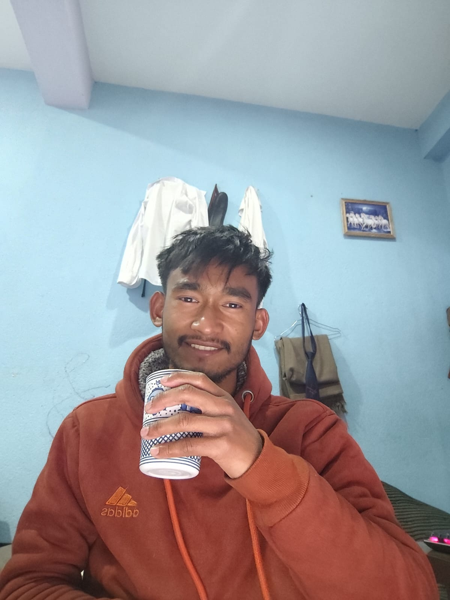
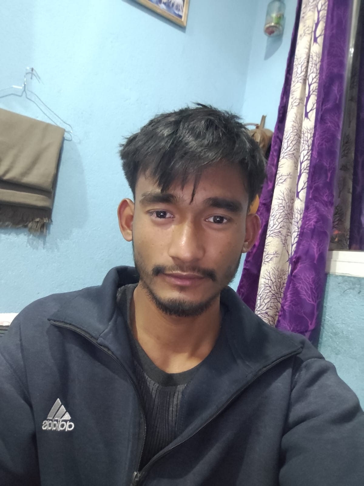
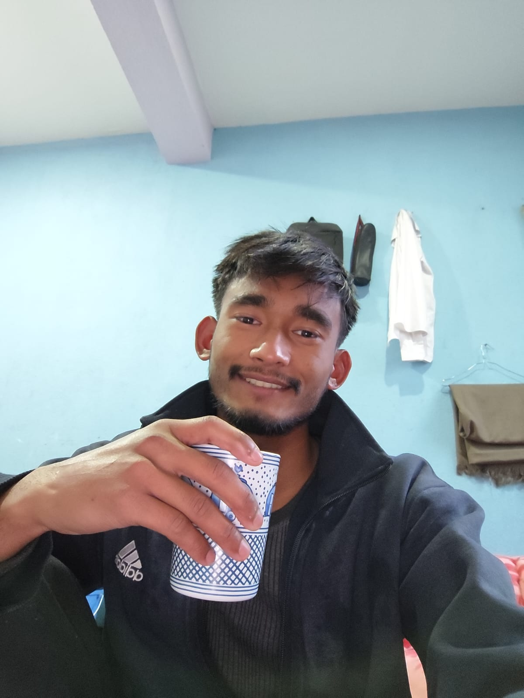
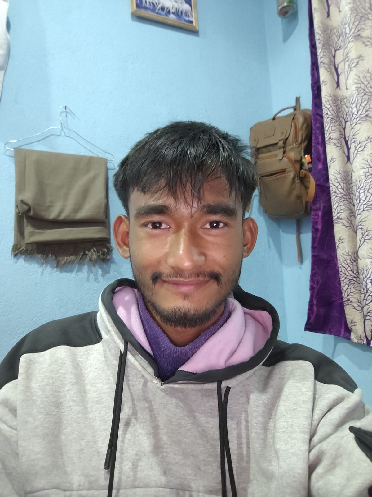
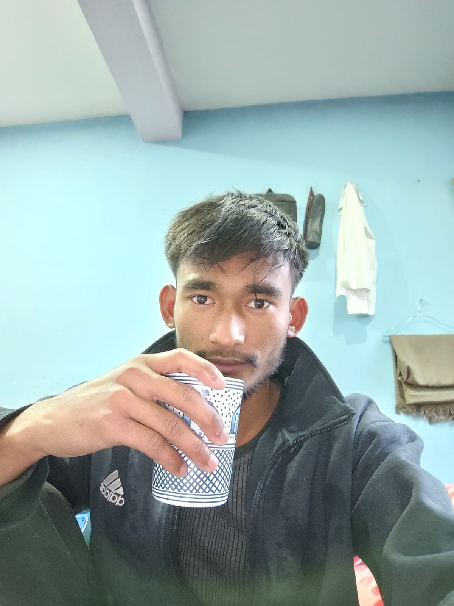
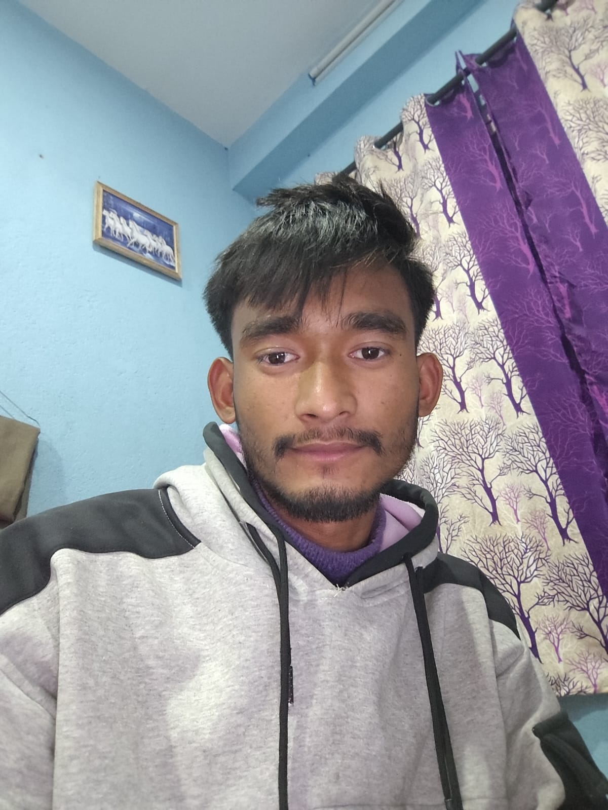

# 📌 Daily Progress & Self-Development Tracker

कृष्णाय वासुदेवाय हरये परमात्मने, प्रणतः क्लेशनाशाय गोविंदाय नमो नमः

  

---

Welcome to my GitHub!  
This repository serves as a daily tracker to remind me of my goals, progress, and self-improvement journey.  
It helps me stay consistent, disciplined, and motivated every day.

---

## 🚀 Daily Quote

> "Success is the sum of small efforts, repeated day in and day out." – Robert Collier

> "It does not matter how slowly you go as long as you do not stop." — Confucius

> "Believe you can, and you're halfway there." — Theodore Roosevelt 

> "Success is getting what you want. Happiness is wanting what you get." – Dale Carnegie 

> "Be the change that you wish to see in the world." — Mahatma Gandhi 

>  "Either you run the day, or the day runs you" by Thomas A. Edison.

*(I will update this section daily with a new quote to inspire myself and others.)*

---

## 🎯 My Goals

- 🔥 Stay disciplined and consistent in coding & learning.
- 📚 Improve my problem-solving skills and software development knowledge.
- 🏆 Build meaningful projects and contribute to open source.
- 📝 Document my journey, experiences, and lessons learned.
- 💪 Develop a strong mindset for growth and self-improvement.

---
## 📅 Progress Tracking

## 💻 [Programming & Coding](https://github.com/SharwanKunwar/Data-Structure-and-algorithm-2025-) *(click me)*  

| Date  StartingFrom(2081) | Task01                             | Task02           | Task03     | Day | Status |
|------------------------------|------------------------------------|------------------|------------|-----|--------|
| 2081-10-25                   | DSA in Java                        | Methods          | 5 Question | 01  | ✅      |
| 2081-10-26                   | DSA in Java                        | Methods          | 5 Question | 02  | ✅      |
| 2081-10-27                   | DSA in Java                        | Methods          | 5 Question | 03  | ✅      |
| 2081-10-28                   | DSA in Java                        | Methods          | 3 Question | 04  | ✅      |
| 2081-10-29                   | DSA in Java                        | Methods          | 2 Question | 05  | ✅      |
| 2081-10-29                   | DSA in Java                        | Methods + gitHub | 5 Question | 06  |        |

*(I will update these tables daily to track my progress and learning.)*

 

## 📚 [Academic Study](https://github.com/SharwanKunwar/BCA---BOOKS---CONTENT) *(click me)*

| Date StartingFrom(2081) | CFA                       | Digital_Logic         | Math                 | Sociology                  | English                                     | Day | Status |
|-------------------------|---------------------------|-----------------------|----------------------|----------------------------|---------------------------------------------|-----|--------|
| 2081-10-25              | Introduction_to Computers | Sequential Circuits   | Derivative           | Family                     | VR Technology                               | 01  | ✅      |
| 2081-10-26              | Evolution of Computers    | NOR_and_NAND SR Latch | First_principle      | Marriage                   | Unit01_personal_computing and the processor | 02  | ✅      |
| 2081-10-27              | Computer Software         | ---                   | Matrix               | kinship                    | ---                                         | 03  | ❌      |
| 2081-10-28              | Operating System          | Ring counter          | exercise             | Questions                  | Portable computer and operating system      | 04  | ✅      |
| 2081-10-29              | Excel                     | Shift Register        | properties of matrix | Research in social science | review unit 02                              | 05  | ✅      |
| 2081-10-30              | ---                       | ---                   | ---                  | ---                        | ---                                         | 06  |        |

*(I will update these tables daily to track my progress and learning.)*

---

## 🛠️ Tools & Technologies I'm Using

- **Languages:** Java and C
- **Databases:** MongoDB, MySQL, PostgreSQL
- **Tools:** IntelliJ IDEA, Visual Studio, Git & GitHub, Docker

---

## 📖 Self-Development Habits

- 📌 Write daily quotes to keep myself inspired.
- 🏋️ Maintain discipline in work and self-growth.
- 🕰️ Follow a structured schedule for learning and coding.
- 📑 Read books and explore new ideas.
- ✅ Maintain consistency and avoid procrastination.

---

## 📌 Reminder to Myself

> "Be consistent, stay focused, and never stop improving. Small steps each day lead to big achievements!"

---

This README is my daily motivator. Let’s keep growing, learning, and achieving great things! 🚀

---

## <table><td>💌Day02</td></table>

<table>

<tr>

<td align="center">** Morning Snap **</td>
<td align="center">** Evening Snap **</td>

</tr>

<tr>

<td></td>
<td></td>

</tr>
</table>

<table>
<td>"Today has been a productive and diverse learning day for me! I started the morning with Data Structures and Algorithms (DSA) in Java, diving into the concepts and practicing five questions to strengthen my understanding. Then, I moved on to Digital Logic, specifically focusing on SR latches using NOR and NAND gates, adding more depth to my knowledge.

After that,
I tackled a mathematical topic—derivatives using the first principle—gaining insight into the foundational concepts.
My studies then took me to the evolution of computers in the CFA course,
followed by sociology, where I explored the topic of marriage.

In English, I worked through Unit 01, focusing on personal computing and processors,
which ties in nicely with my broader technical learning.
Later I updated my journey on GitHub, tracking my progress.

Now, I'm wrapping up the day with the final documentation,
reflecting on everything I've learned and feeling excited about tomorrow’s challenges and discoveries!
I've covered a wide range of topics,
balancing technical, mathematical, and theoretical areas,
and all in all, it's been a fulfilling day of growth and progress!

I want to thank myself for the effort I've put into today,
and I also want to thank Mahakal for guiding me through this journey.
Here’s to more growth ahead!"

<Table>

<tr bgcolor="#000">
<td>Author</td>
<td>Last Updated</td>
<td>Time</td>
<td>Status</td>
</tr>

<tr>
<td>Sharwan jung kunwar</td>
<td>2081-10-26</td>
<td>8:08</td>
<td>Completed</td>
</tr>
 
</Table>
</table>

  

---

---

## <table><td>💌Day03</td></table>

<table>

<tr>

<td align="center">** Morning Snap **</td>
<td align="center">** Evening Snap **</td>

</tr>

<tr>

<td></td>
<td></td>

</tr>
</table>

<table>
<td>
today's review and description i mean making what i do all day 

first i get up early 4:30 then i get fress in 10 minutes then i wash my dish, then cook food for myself,  and in the background i play music and enjoy after 30 - 40 minutes latter i start reading my colledget stuff in colledge content i have studies math in math i study matrix today and grab the concept , then digital logic i just revise yesterday concept sr latch , then i study cfa in cfa i study about comptuer software then in english i read about english communication then in socilolgy i study kinship and society then finally in the evening which i came back to my room i study programming dsa in java with 5 mehods question then it's now i am writing the day note.  
Today might feel incomplete, but I'm still happy. Sometimes things don't go as planned, yet there's still contentment in the little things. It’s not about perfection—just embracing the moments and being grateful for what I have right now. I did leave two books unfinished, not completely, but I did miss out on some parts of digital logic and English. I'll get back to them when I can.
  
### Random Thoughts

You don't need a person or their blessings if you do what you are supposed to do.
I feel invisible in a crowd, but my inner self recognizes this invisibleness. It feels like I am nothing, but deep down, I know what I have to do to overcome these feelings.
Sometimes I think about being humble, but my past experiences don’t allow me to do so. Now, it’s just me and myself. We love each other—me and I.
The bus is my life, and the crowd is my insight.
He desires things that he already has.
Writing thoughts on paper is like sleeping on the bed after...
Now I'm a professional walker.
He who remains the same until he knows the art of letting go.
To reach my college, it takes an hour. During that time, I reflect on my thoughts, who I was, and who I want to be. In that hour, I plan my day, my mood, and my feelings—focused on self-development, skills to acquire, discipline, and consistency for my journey. Today, I’m happy to have these thoughts, even if they don’t make me happy. No worries, as long as I am conscious of myself and my thoughts. I can handle anything, and I believe that one day, these thoughts will mean a lot.
Do you really think this is who I am? Maybe yes, maybe no. Then the question is, who the heck am I? I am not my thoughts, so who am I? At this moment, I am a traveler, and when I reach college, I am a student. When I study something, I am a student again. This identity switches depending on my state or location.
Who I was, who I am, and who I want to be.
Words may not mean much, but tone matters.
What matters to you or what you deserve? Find the way that works for you.
</td>
<Table>

<tr bgcolor="#000">
<td>Author</td>
<td>Last Updated</td>
<td>Time</td>
<td>Status</td>
</tr>

<tr>
<td>Sharwan jung kunwar</td>
<td>2081-10-27</td>
<td>7:22</td>
<td>Incomplete</td>
</tr>
 
</Table>
</table>

  

___

## <table><td>💌Day04</td></table>

<table>

<tr>

<td align="center">** Morning Snap **</td>
<td align="center">** Evening Snap **</td>

</tr>

<tr>

<td></td>
<td></td>

</tr>
</table>

<table>
<td>
Today has been another fulfilling and productive day of learning! I started with Data Structures and Algorithms (DSA) in Java, practicing five problems to strengthen my problem-solving skills. Moving forward, I explored Digital Logic, where I studied ring counters. It was a bit challenging at first, but with effort, I was able to grasp the concept.

Next, I shifted to mathematics, where I practiced matrix-related problems, reinforcing my understanding of linear algebra. In my CFA course, I focused on operating systems, learning about their role in managing hardware and software. Similarly, in English, I studied portable computers and operating systems, expanding my knowledge of computing technologies.

For sociology, I worked on exercises related to marriage, applying what I’ve learned to deepen my understanding. After completing my studies, I updated my GitHub with today’s progress, ensuring I stay on track with my journey.

As I wrap up the day, I take a moment to appreciate the effort I’ve put in and the progress I’m making. I’m grateful to myself for staying committed and to Mahakal for guiding me through this journey. Looking forward to tomorrow’s challenges and new discoveries—onward to more growth! 🚀
</td>
<Table>

<tr bgcolor="#000">
<td>Author</td>
<td>Last Updated</td>
<td>Time</td>
<td>Status</td>
</tr>

<tr>
<td>Sharwan jung kunwar</td>
<td>2081-10-28</td>
<td>6:32 PM</td>
<td>complete</td>
</tr>
 
</Table>
</table>

---

## <table><td>💌Day05</td></table>

<table>

<tr>

<td align="center">** Morning Snap **</td>
<td align="center">** Evening Snap **</td>

</tr>

<tr>

<td></td>
<td></td>

</tr>
</table>

<table>
<td>
Today has been another fulfilling and productive day of learning! I started with Data Structures and Algorithms (DSA) in Java, practicing five problems to strengthen my problem-solving skills. Moving forward, I explored Digital Logic, where I studied ring counters. It was a bit challenging at first, but with effort, I was able to grasp the concept.

Next, I shifted to mathematics, where I practiced matrix-related problems, reinforcing my understanding of linear algebra. In my CFA course, I focused on operating systems, learning about their role in managing hardware and software. Similarly, in English, I studied portable computers and operating systems, expanding my knowledge of computing technologies.

For sociology, I worked on exercises related to marriage, applying what I’ve learned to deepen my understanding. After completing my studies, I updated my GitHub with today’s progress, ensuring I stay on track with my journey.

As I wrap up the day, I take a moment to appreciate the effort I’ve put in and the progress I’m making. I’m grateful to myself for staying committed and to Mahakal for guiding me through this journey. Looking forward to tomorrow’s challenges and new discoveries—onward to more growth! 🚀
</td>
<Table>

<tr bgcolor="#000">
<td>Author</td>
<td>Last Updated</td>
<td>Time</td>
<td>Status</td>
</tr>

<tr>
<td>Sharwan jung kunwar</td>
<td>2081-10-29</td>
<td>6:36 PM</td>
<td>complete</td>
</tr>
 
</Table>
</table>

---

