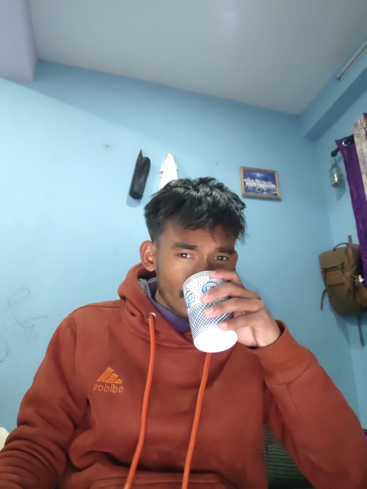
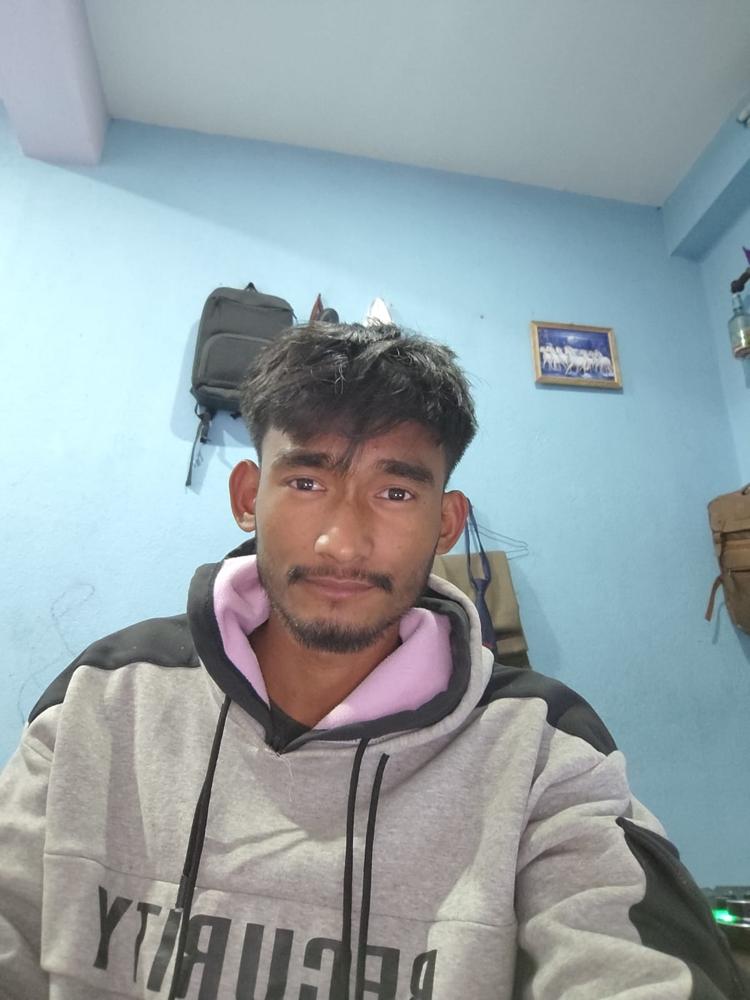

# 📌 Daily Progress & Self-Development Tracker

कृष्णाय वासुदेवाय हरये परमात्मने, प्रणतः क्लेशनाशाय गोविंदाय नमो नमः

  

---

Welcome to my GitHub!  
This repository serves as a daily tracker to remind me of my goals, progress, and self-improvement journey.  
It helps me stay consistent, disciplined, and motivated every day.

---

## 🚀 Daily Quote

> "Success is the sum of small efforts, repeated day in and day out." – Robert Collier

> "It does not matter how slowly you go as long as you do not stop." – Confucius

*(I will update this section daily with a new quote to inspire myself and others.)*

---

## 🎯 My Goals

- 🔥 Stay disciplined and consistent in coding & learning.
- 📚 Improve my problem-solving skills and software development knowledge.
- 🏆 Build meaningful projects and contribute to open source.
- 📝 Document my journey, experiences, and lessons learned.
- 💪 Develop a strong mindset for growth and self-improvement.

---
## 📅 Progress Tracking

## 💻 [Programming & Coding](https://github.com/SharwanKunwar/Data-Structure-and-algorithm-2025-) *(click me)*  

| Date  StartingFrom(2081) | Task01                             | Task02      | Task03     | Day                                                                               | Status |
|------------------------------|------------------------------------|-------------|------------|-----------------------------------------------------------------------------------|--------|
| 2081-10-25                   | DSA in Java                        | Methods     | 5 Question | [01]()                                                                            | ✅      |
| 2081-10-26                   | DSA in Java                        | Methods     | 5 Question | [02](https://github.com/SharwanKunwar/My-Journey-2081-?tab=readme-ov-file#day01)  |  ✅     |

*(I will update these tables daily to track my progress and learning.)*

 

## 📚 [Academic Study](https://github.com/SharwanKunwar/BCA---BOOKS---CONTENT) *(click me)*

| Date StartingFrom(2081) | CFA                       | Digital_Logic         | Math            | Sociology | English                                     | Day                                                                               | Status |
|-------------------------|---------------------------|-----------------------|-----------------|-----------|---------------------------------------------|-----------------------------------------------------------------------------------|--------|
| 2081-10-25              | Introduction_to Computers | Sequential Circuits   | Derivative      | Family    | VR Technology                               | [01]()                                                                            | ✅      |
| 2081-10-26              | Evolution of Computers    | NOR_and_NAND SR Latch | First_principle | Marriage  | Unit01_personal_computing and the processor | [02](https://github.com/SharwanKunwar/My-Journey-2081-?tab=readme-ov-file#day01)  | ✅      |

*(I will update these tables daily to track my progress and learning.)*

---

## 🛠️ Tools & Technologies I'm Using

- **Languages:** Java and C
- **Databases:** MongoDB, MySQL, PostgreSQL
- **Tools:** IntelliJ IDEA, Visual Studio, Git & GitHub, Docker

---

## 📖 Self-Development Habits

- 📌 Write daily quotes to keep myself inspired.
- 🏋️ Maintain discipline in work and self-growth.
- 🕰️ Follow a structured schedule for learning and coding.
- 📑 Read books and explore new ideas.
- ✅ Maintain consistency and avoid procrastination.

---

## 📌 Reminder to Myself

> "Be consistent, stay focused, and never stop improving. Small steps each day lead to big achievements!"

---

This README is my daily motivator. Let’s keep growing, learning, and achieving great things! 🚀

<table><td>💌Day01</td></table>

<table>

<tr>

<td align="center">** Morning Snap **</td>
<td align="center">** Evening Snap **</td>

</tr>

<tr>

<td></td>
<td></td>

</tr>
</table>

<table>
<td>"Today has been a productive and diverse learning day for me! I started the morning with Data Structures and Algorithms (DSA) in Java, diving into the concepts and practicing five questions to strengthen my understanding. Then, I moved on to Digital Logic, specifically focusing on SR latches using NOR and NAND gates, adding more depth to my knowledge.

After that,
I tackled a mathematical topic—derivatives using the first principle—gaining insight into the foundational concepts.
My studies then took me to the evolution of computers in the CFA course,
followed by sociology, where I explored the topic of marriage.

In English, I worked through Unit 01, focusing on personal computing and processors,
which ties in nicely with my broader technical learning.
Later I updated my journey on GitHub, tracking my progress.

Now, I'm wrapping up the day with the final documentation,
reflecting on everything I've learned and feeling excited about tomorrow’s challenges and discoveries!
I've covered a wide range of topics,
balancing technical, mathematical, and theoretical areas,
and all in all, it's been a fulfilling day of growth and progress!

I want to thank myself for the effort I've put into today,
and I also want to thank Mahakal for guiding me through this journey.
Here’s to more growth ahead!"</td>
</table>

---
### **📌 Author:** Sharwan Jung Kunwar
### **📅 Last Updated:** 2081-10-26 ||Time 8:08 

